# Menu
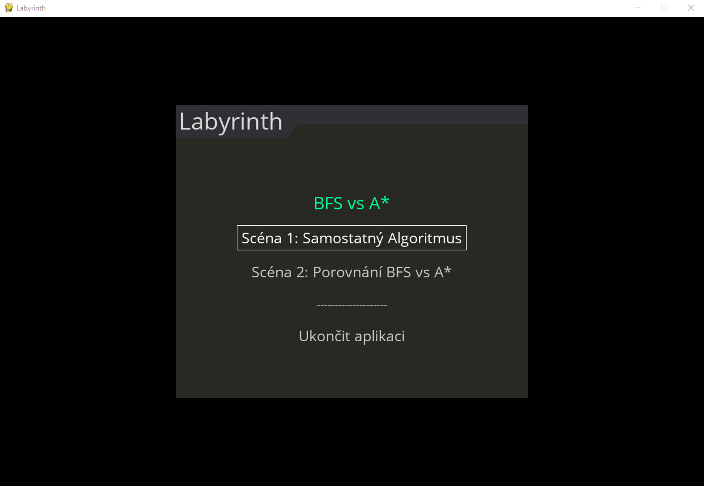
Takto vypadá hlavní menu. Zde si uživatel vybere scénu, kterou otevře.

# Scéna 1
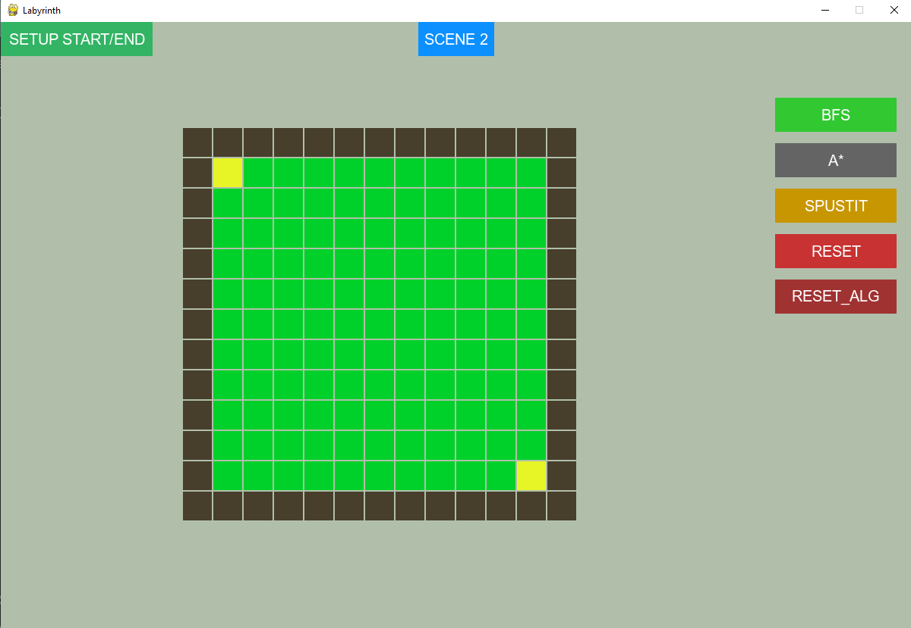
Scénu 1 tvoří mřížka, tedy náš labyrint. Kliknutím na políčko se změní jeho role (viz uživatelská příručka). Napravo jsou tlačítka na ovládání mřížky. První dvě slouží ke zvolení algoritmu, zvolený algoritmus svítí zelenou barvou. Tlačítko Spustit poté spustí algoritmus a zobrazí se nejkratší cesta. Tlačítko Reset pak resetuje celou mřížku a reset_alg pouze vymaže nalezenou cestu, aby uživatel nemusel znovu vytvářet zdi.

Tlačítko SETUP START/END slouží k nastavení startovního políčka a cílového políčka. Uživatel klikne na tlačítko, tlačítko změní barvu, prvním kliknutím nastaví startovní políčko, druhým kliknutím nastaví cílové políčko. 

Tlačítko SCENE 2 nás přesune na scénu s porovnáním algoritmů.

## Scéna 1 - nastavení mřížky
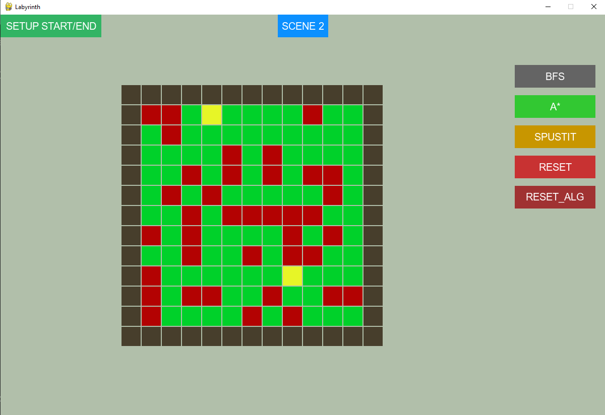
Takto vypadá mřížka po nastavení zdí.
## Scéna 1 - zobrazení nejkratší cesty
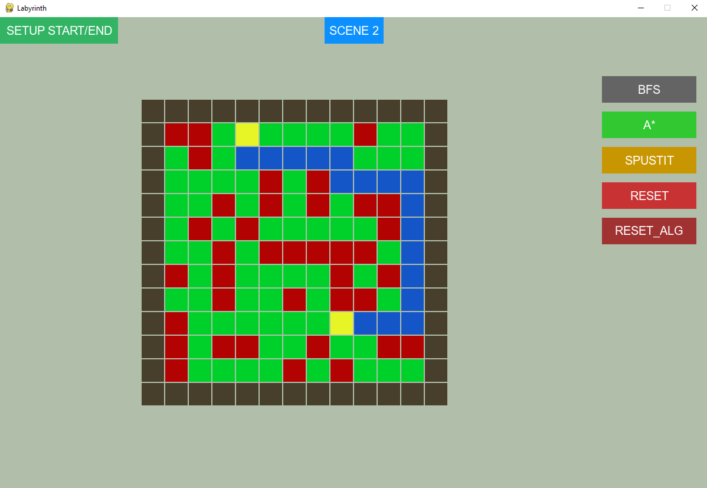
Takto po nalezení nejkratší cesty pomocí algoritmu A*.

# Scéna 2
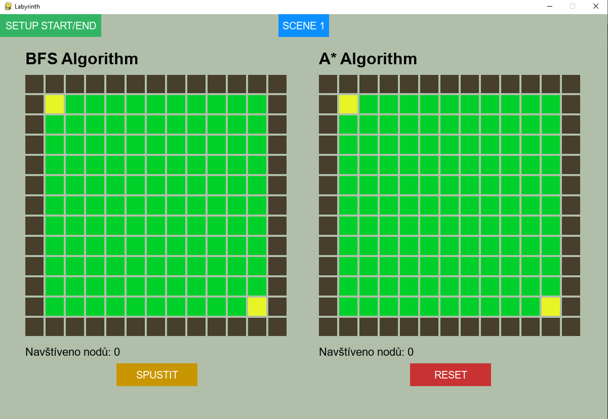
Scénu 2 tvoří tentokrát dvě mřížky, které jsou rozeznatelné pomocí horního nadpisu. Tato scéna slouží k porovnání, jak jednotlivé algoritmy mřížkou prochází a jak se liší. Tlačítka fungují stejně jako ve scéně 1.

## Scéna 2 - nastavení mřížky
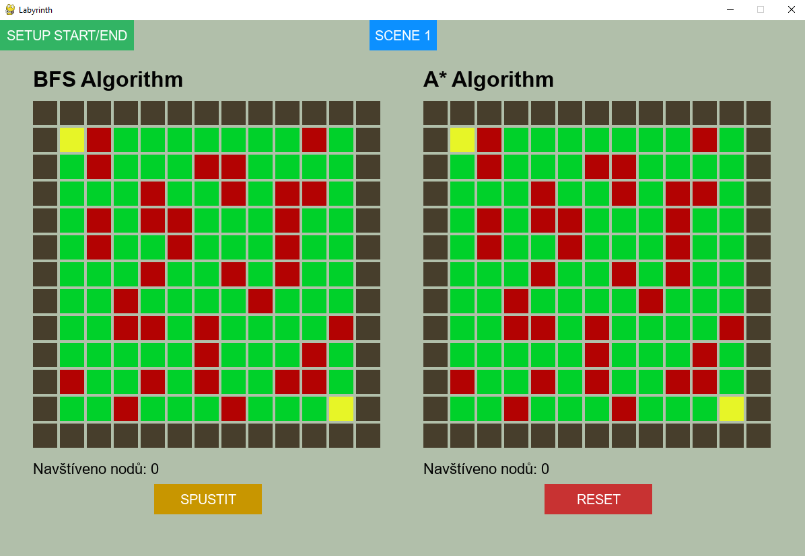

## Scéna 2 - zobrazení porovnání
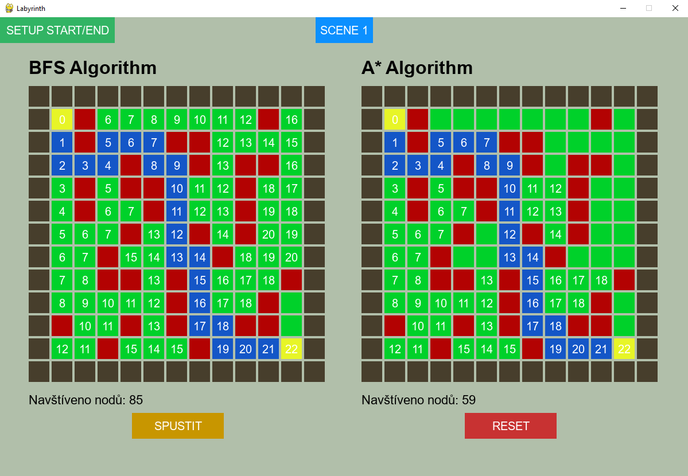
Zde vidíme, jak mřížka vypadá pro porovnání algoritmů. Modrá cesta značí nejkratší cestu. Číslo na políčku značí, jak daleko je od startovního políčka. Každé políčko, které má na sobě číslo, bylo navštíveno. Takto názorně vidíme, která políčka algoritmus A* nenavštíví, na rozdíl od algoritmu BFS.
Pod mřížkou je zobrazen počet navštívených políček pro každý z algoritmů.

## Scéna 2 - mřížka bez zdí
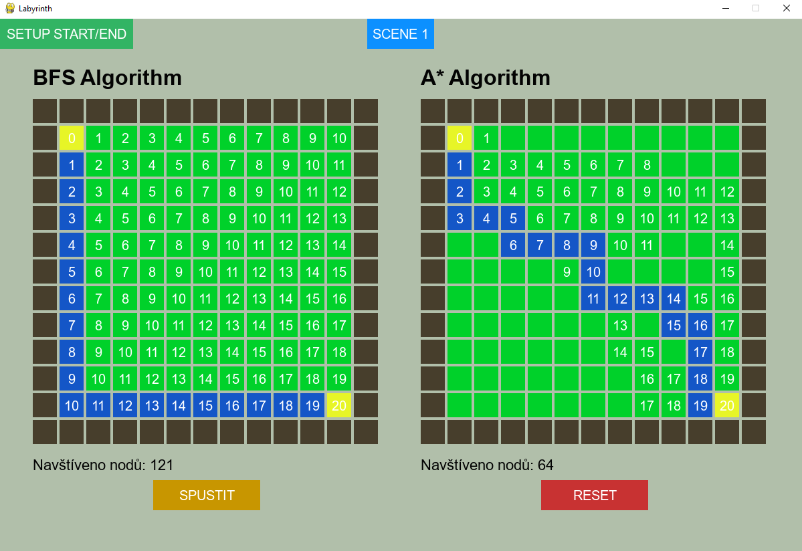
Příklad, kdy v mřížce není žádná zeď.
## Scéna 2 - počty průchodů BFS a A* jsou shodné?!
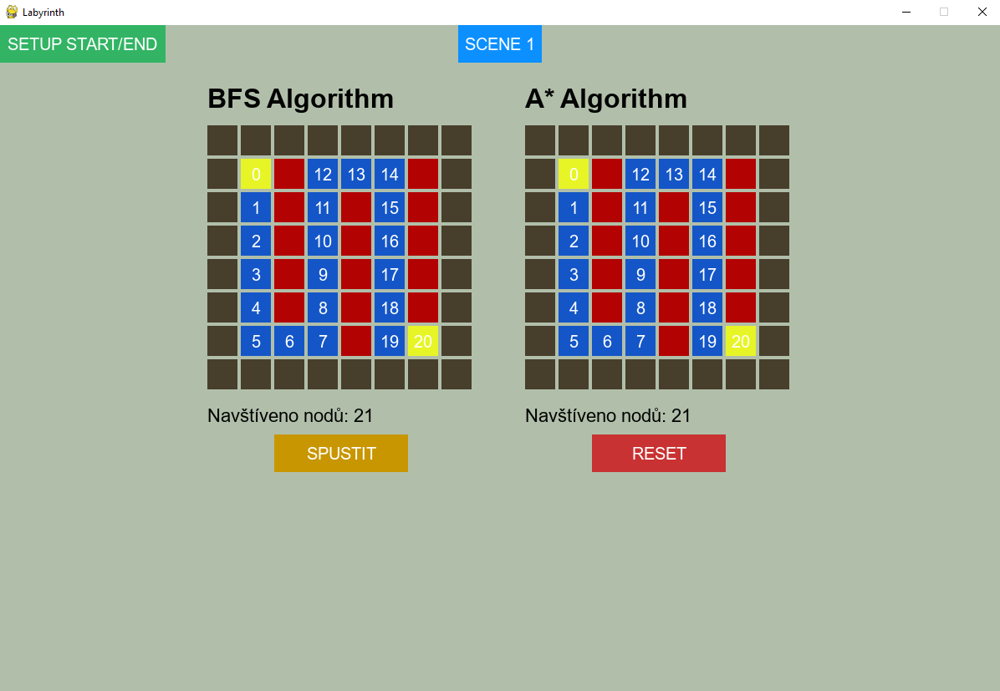
Případ, kdy A* není rychlejší než BFS.
## Scéna 2 - čím víc zdí, tím méně průchodů
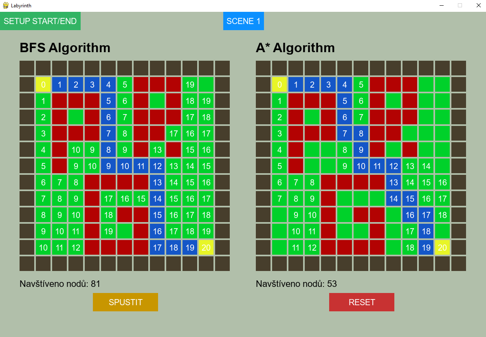
Zajímavým poznatkem (ačkoliv docela logickým) je, že přidáním zdí vlastně zmenšujeme počet potenciálně možných políček k průchodu, tedy přidáním zdí urychlujeme výpočet, což dává smysl, jelikož na to lze pohlížet jako na nějaké omezování vyhledávacího stromu.

## Scéna 2 - další zajímavý případ
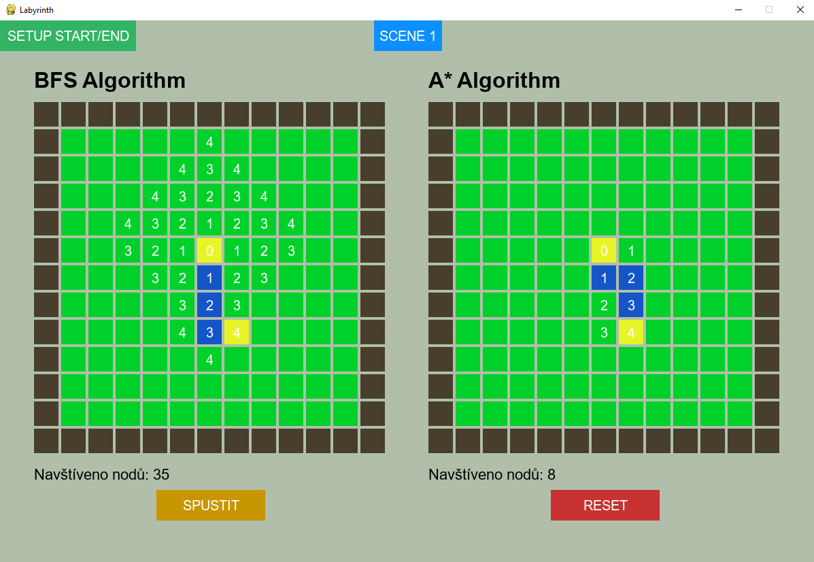

## Rozcestník
* [Úvod](uvod.md)
* [Uživatelská dokumentace](uzivatelskaPrirucka.md)
* [Ukázky použití](examples.md)
* [Programátorská dokumentace](programatorskaDokumentace.md)
* [Instalace](instalace.md)
